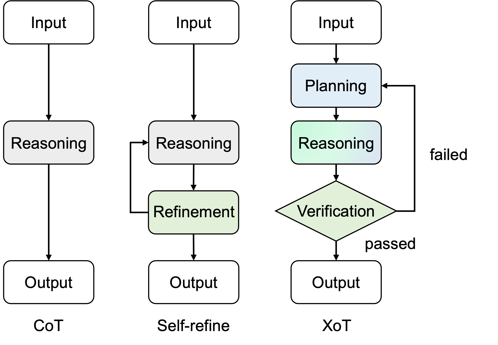

# XoT

Implementation for EMNLP 2023 [paper](https://arxiv.org/pdf/2310.14628.pdf):

Plan, Verify and Switch: Integrated Reasoning with Diverse X-of-Thoughts



## Install dependencies

Install all the dependencies in the requirements.txt file:
```
pip -r requirements.txt
```

## Run the code

### Generate XoT results

Please put your api key in the [Line 24](https://github.com/tengxiaoliu/XoT/blob/main/src/brain.py#L24) of `brain.py` file.

We here provide the command to generate XoT results on GSM8K. To run the code on other datasets, please change the `--dataset` argument accordingly.

```
bash scripts/run_gsm.sh
```

This will produce 6 files in the `outputs/gsm` folder.


### Evaluate and Analyze

We use the `analyze.py` script to evaluate and analyze the generated XoT results, which provides a thorough analysis as reported in the paper. 
To run the script, please use the following command:
```
bash scripts/eval_gsm.sh
```
You can also directly run the analysis with the above command using the output files we produced in the `outputs/gsm` folder.


## Questions
This repo is still under construction. 
If you have any questions, please feel free to open an issue or contact me at `txliu21@m.fudan.edu.cn`.